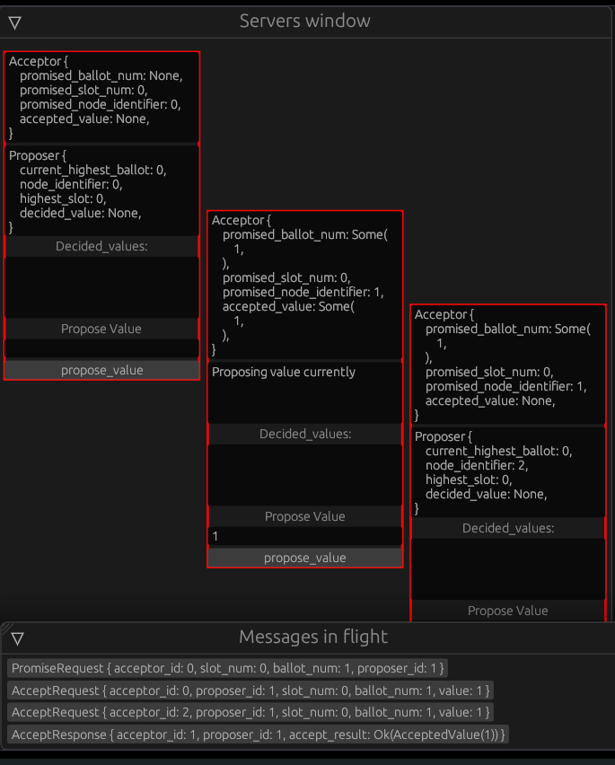

# About 
This is the playground for the paxos protocol.

It allows the user to control when messages are sent and responses are received.

This is a useful tool in the learning process being an interactive way to see how the proposers and acceptors react to different scenarios.

# Issues
- I haven't figured out the reason for the staggered server windows
- I'm not a big fan of how I propagate the decided values.  A better demo could be built in the future

